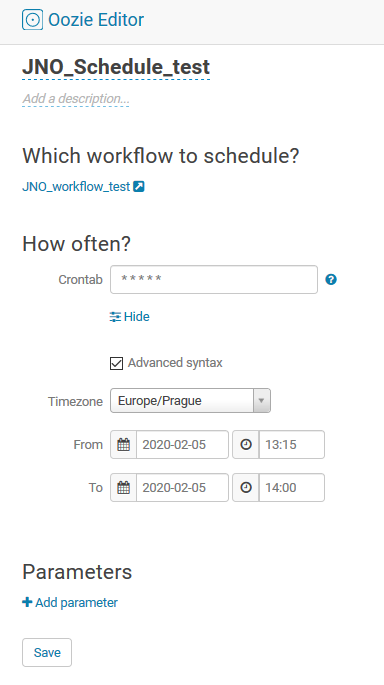

# Lab2: Schedule a Hive query

## Lab goal: 
Once done, user will be able to schedule Hive query within Hue with help of Oozie. 

### Step1: Create a table for storing results
It's important to have a table where data from scheduled runs will be stored. Therefore is need to create a table: 

> CREATE TABLE 202002_workshop.jno_scheduler_output  
> (  
> Incremental_ID INT,   
> time TIMESTAMP   
> )  
> STORED AS PARQUET; 

Not important in this step, but better to do that - refresh metadata after creation of the table. In case you write code in Hive, there is no need to run following command, just for Impala: 

> REFRESH 202002_workshop.jno_scheduler_output; 

### Step 2: Create and save a Hive query
Since we have created a table into that result of schedulled query will be saved, we can prepare some sample query. Let's have e.g.

> INSERT INTO 202002_workshop.jno_scheduler_output  
> SELECT cast(nvl(max(incremental_id),1)+1 as int), current_timestamp() FROM 202002_workshop.jno_scheduler_output;  

and hit save the query. Have only this query in the query window. 

### Step 3: Create workflow
Open Scheduler - Worflow and create new workflow: drag and drop Hive query. 

Save the schedule under your name e.g. JNO_schedule_test_202002

<i> Note: It's important to change Actions into Documents. Hive query isn't available in Actions. </i>

### Step 4: Schedule query
Open Scheduler - Schedule  
Define new schedule: add workflow you created in the previous step and set scheduler.  

e.g. * 16-17 * * *  -> query will run each day, each minute between 16-17 hour (4-5pm). 
<u> help: </u>  
1st possition: Minute (0-59)  
2nd possition: Hour (0-23) 
3rd possition: Day of month (1-31)  
4th possition: Month of year (1-12)  
5th possition: Day of week (0-7) 0 and 7 are Sundays  
               

Save the schedule.

### Step 5: Check results
First step is to refresh medata in case you didn't add REFRESH databasename.tablename at the end of scheduled script.

Run:
> REFRESH 202002_workshop.jno_scheduler_output; 

Now you are able to select your data in table. Run: 
> SELECT * FROM 202002_workshop.jno_scheduler_output;

